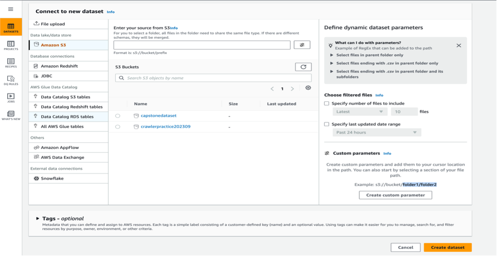
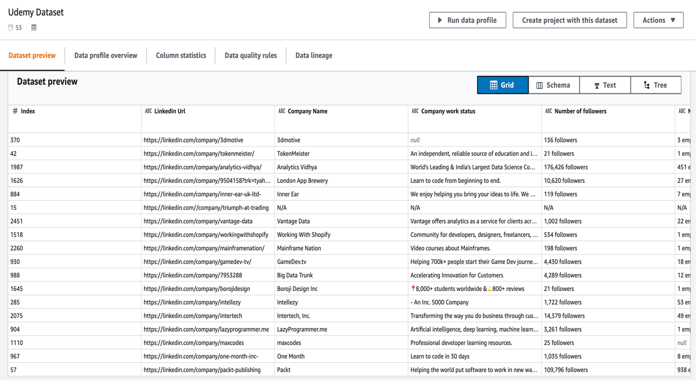
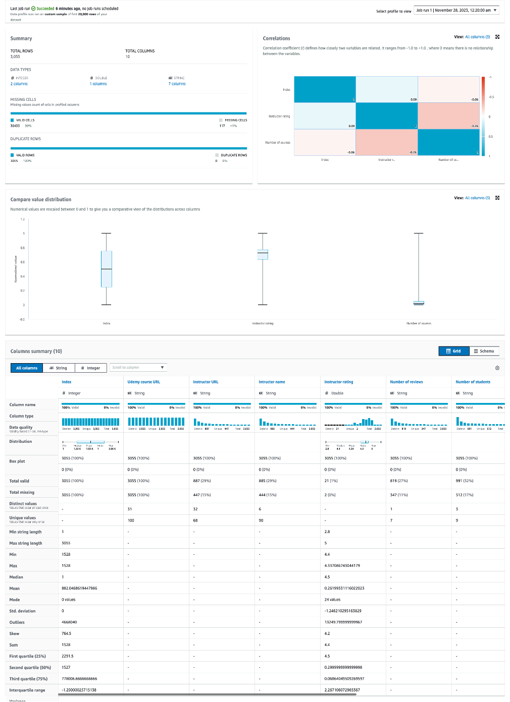
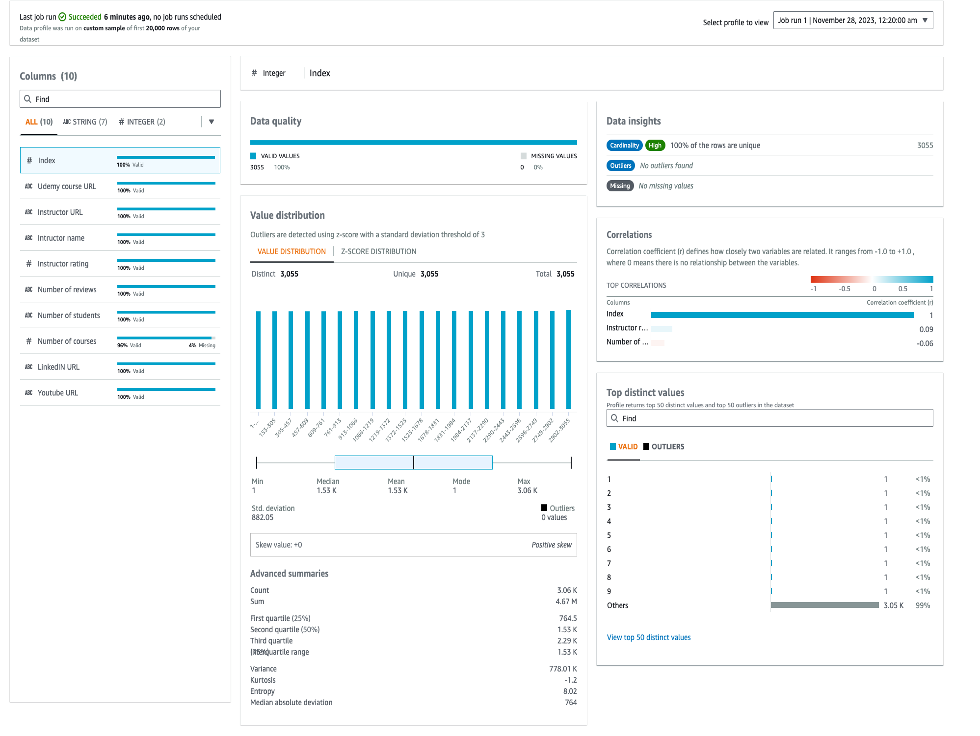
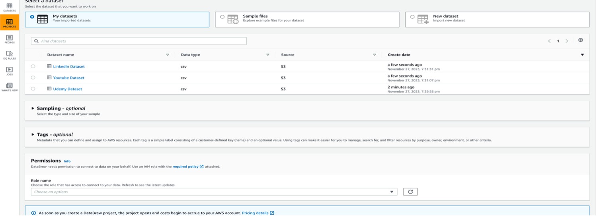
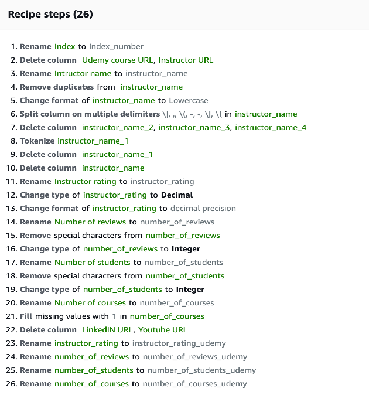
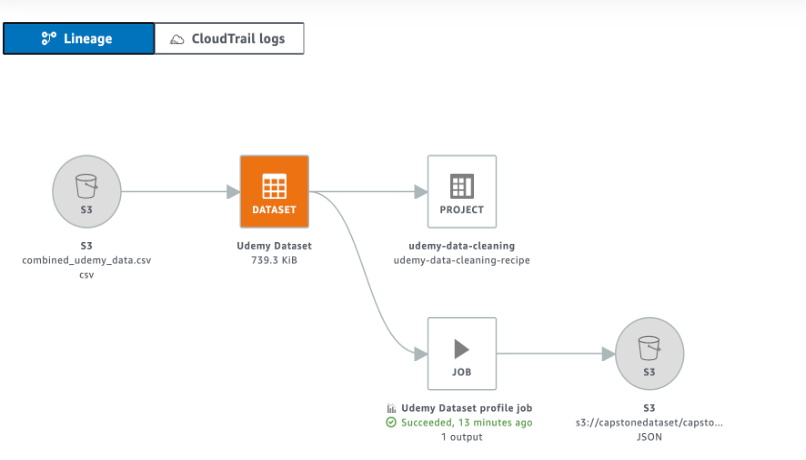

# Unleashing the Potential of Data Transformation with AWS Glue DataBrew

In the dynamic realm of data analytics, the key to unlocking insights lies in the art of data transformation. Recently, I had the opportunity to harness the capabilities of AWS Glue DataBrew in a transformative project, where the goal was to turn disorganized datasets into analytical gold.

## The Project Journey 🚀
The project involved analyzing diverse datasets from LinkedIn, Udemy, and YouTube to uncover correlations between Udemy student numbers and instructors' social media engagement on platforms like LinkedIn and YouTube. Challenges such as missing values, inconsistent formatting, and special characters were encountered in each dataset. AWS Glue DataBrew proved instrumental in simplifying the data preparation process, serving as a transformative tool.

This article will initially cover core concepts of AWS Glue DataBrew, followed by an overview of how these concepts were applied in my project.

## Unveiling AWS Glue DataBrew 🧹 
The intuitive features render intricate coding unnecessary. It serves as a no-code visual data preparation tool, enabling users to cleanse and standardize data effortlessly, without the need for manual code composition.

### 1. Dataset Connection:
 Dataset can be regarded as a well-organized library, where information is neatly sorted into rows and columns. Now, when you start a DataBrew project, it's like you're opening the doors to this library—connecting to or uploading data for a bit of a transformation. This dataset is your backstage pass, mingling with different sources and directly hooking up to various data stores. The neat trick here? In DataBrew, a dataset is like a trusty reference book. It's a read-only connection, gathering details about your data for easy reference, keeping things super clear between the actual dataset and the information we use to describe it.

### 2.	Project: 
Project acts as a data's personal stylist. It's this dynamic space where you get your data all dressed up and ready. It's like a control center where you're in charge of everything—from the data itself to making it go through some transformations and scheduled processes. Now, when you kick off a project, the first big move is choosing or creating a dataset. This dataset becomes the heart of it all, molding your data into this sleek, ready-to-use form for the entire data pipeline.

### 3.	Recipes: 
Recipe is like a playbook for your data. It's this step-by-step guide telling DataBrew exactly what to do with your data. Imagine these steps as a recipe in a cookbook, each one with its own set of actions. To make these changes happen, you've got these handy transformation tools on the toolbar. Once your recipe is good to go, you hand it over to DataBrew, schedule it, and there you have it—the result is ready for you. The cool part? DataBrew holds onto the recipe details, not the actual data. Plus, you can download and reuse these recipes in different projects, whipping up various versions whenever you need them.

### 4.	Job: 
DataBrew takes on the task of transforming your data by following the instructions you set up when you made a recipe. Now, this whole process of running those instructions is what we call a job. A job can put your data recipes into action based on a set schedule, but hey, you're not stuck to a timetable. You can also run jobs whenever you need them. For instance, if you want to check out some data without a specific recipe, no worries. You can set up a profile job to create a data profile—easy peasy.

### 5.	Data Lineage: 
Data Lineage is like a visual map that tracks your data's journey, showing where it came from and how it moves through different entities. This view, known as data lineage, lets you see the origin of your data, the other entities it bumped into, how it changed over time, and where it ended up getting stored. It's like a travel log for your data.

### 6.	Data Profile: 
When you want the lowdown on your data, that's where data profiling in DataBrew comes in. It's like creating a report called a data profile. This report spills the beans on your data, giving you the scoop on its shape, the context of its content, the data structure, and its relationships. You can whip up a data profile for any dataset by running a data profile job—it's your go-to summary for understanding what's going on with your data.

## Data Cleaning Steps using AWS Glue DataBrew in my Project.

### Step 1: Creating a Dataset 
First, I created a new dataset by uploading a CSV file from S3 and giving a name to the dataset. I created three datasets: Udemy, YouTube, and LinkedIn. 

 
After creating the datasets, we can observe (as attached above: Udemy dataset for reference) that it provides an overall preview of our data.

### Step 2: Data Profile Job
After creating a dataset, we can run a data profile job to understand the structure of our data. The output of this job will be saved to Amazon S3. The data profile job is initiated by providing a job profile name, specifying the S3 path, and configuring additional settings such as dataset-level configurations or column-level configurations. Additionally, we set up the required role name and permissions.

In the Udemy dataset, we started with 3055 pieces of information organized in 10 categories (columns). There were 117 empty spots in our data. To understand it better, we looked at correlation, box plots for outliers, a summary of each column, and the types of data in them.

This process was done for all three datasets to thoroughly explore our data.

### Step 3: Creating a Project
Then I began by establishing a Udemy project, connecting it to the dataset generated in the previous step. This involved assigning a project name, selecting the dataset, specifying the desired number of rows for our sample data, and configuring the necessary permissions and IAM roles.
Three projects were created one for each dataset.

 
After making the project, we go into the workspace to clean up the dataset. In the workspace, we create recipes to tidy up the data.

### Step 4: Creating Recipes
Recipes were created for each of the dataset (attaching only Udemy for reference).

 
#### a.	Udemy Data Cleaning
The data cleaning process for the Udemy Courses dataset involved several key steps to enhance its quality and structure. The index was renamed to "index_number," and irrelevant columns such as "Udemy Course URL," "Instructor URL," "LinkedIn URL," and "Youtube URL" were deleted for streamlining.

The "Instructor Name" column underwent a comprehensive refinement, including renaming, removal of duplicates, and splitting based on delimiters like |,.,( to extract relevant information. After converting the values to lowercase, the names were joined using an underscore and stored in the destination column "instructor_name." Temporary deletion of the intermediate "instructor_name" column facilitated regression.

For "Instructor Rating," the column was renamed, and its data type was changed to decimal with a precision of 1. The "Number of Reviews" and "Number of Students" columns underwent renaming, removal of special characters, and changes in data type to integers. The "Number of Courses" column was renamed, and missing values were filled with 1 to address data scraping issues.

#### b.	YouTube Data Cleaning
The data cleaning process for the YouTube dataset involved meticulous steps to enhance its quality and structure. The index was renamed to "index_number," and the YouTube URL column was deleted. The "Channel Title" column underwent a series of transformations, including renaming, removal of duplicates and empty rows, conversion to lowercase, tokenization, and eventual deletion.

For the "Subscriber Count" column, custom values were removed, suffixes denoting thousands (K) and millions (M) were addressed, and a new column, "total_subscriber_count," was created by multiplying two relevant columns. The "Number of Videos posted" column underwent a similar process, involving renaming, removal of suffixes, conversion of data types, and the creation of a new column, "total_videos_posted."

The "Channel Created Date" column was cleaned by splitting and categorically mapping the month, resulting in a standardized format of YYYY-MM-DD. The "Overall view count for the channel" was renamed, and commas were removed, with missing values handled appropriately.

The "Channel Description" column was renamed to "channel_description." The "Number of comments on featured video" column was renamed, missing values were filled with zeros, and its data type was changed to integer. The "Featured Video comment" column was split into 20 columns using a specific delimiter.

These comprehensive steps ensure a refined and structured YouTube dataset, laying the foundation for meaningful analysis and insights.

#### c.	LinkedIn Data Cleaning
The data cleaning process for the LinkedIn Instructor dataset involved several key steps. First, adjustments were made to the index and LinkedIn URL columns. The instructor's name underwent a thorough refinement process, including the removal of null values, duplicates, and special characters, as well as a transformation to lowercase and tokenization. The instructor's work status column was permanently deleted, while the number of followers and connections columns were standardized by removing custom values, special characters, and converting data types.

Additionally, a new column, "number_of_connections_mapped," was created to categorize the connection counts. The "About" section underwent renaming and temporary deletion for regression purposes. The counts of reactions and comments for the latest three posts were processed similarly, with null values replaced, special characters removed, and data types adjusted.

Furthermore, the creation of new columns, such as "average_reaction_count" and "average_comment_count," streamlined the dataset. Lastly, the frequency of the latest three posts was addressed, with null values removed and time granularities standardized to days for consistency. The average frequency across these columns was then computed and added to the dataset. Overall, these meticulous steps ensured a clean and standardized dataset for further analysis of LinkedIn Instructors.

### Step 5: Data Lineage

 
In the Udemy dataset journey, we started by bringing in the file from S3, made a dataset and a project. We then used data cleaning steps, checked the dataset profile, and saved the results to S3 after running the profile job.

## Concluding Perspectives on AWS Glue DataBrew 🌐👋
In navigating AWS Glue DataBrew, it's evident that the platform stands out for its user-friendly design and automation prowess. The intuitive, no-code interface heralds a democratization of ETL processes, inviting diverse skill sets into the realm of data analytics. Its automated data profiling and lineage capabilities usher in a new era of insights, seamlessly connecting both technical and non-technical users. The streamlined workflow automation, with over 250 automated processes, not only expedites data preparation but also empowers users to focus on more strategic, analytical tasks. The incorporation of adaptive prescriptive suggestions adds a layer of efficiency, enhancing preprocessing workflows and contributing to a quicker time to benefit. While DataBrew excels in user accessibility and automation, its no-code philosophy may pose challenges for those seeking highly customized solutions, and the cloud-dependent nature could be a consideration for environments with potential connectivity constraints. Despite these considerations, DataBrew remains a potent tool for fostering collaboration, inclusivity, and productivity in the dynamic landscape of data analytics.

## Pricing 💰🔍
The platform offers two distinct models, each catering to different aspects of your data workflow: DataBrew Interactive Sessions and DataBrew Jobs.

### a.	 DataBrew Interactive Sessions: 
This model revolves around the interactive and hands-on aspect of data preparation. It charges based on the time you spend actively working within DataBrew during interactive sessions.
•	The cost per session is $1.00, billed in 30-minute intervals.
•	Pricing Scenarios: For example, if you start a session at 9:00 AM and return from 9:20 AM–9:30 AM, one session is utilized, costing $1.00. Alternatively, starting a session at 9:00 AM, interacting until 9:50 AM, leaving, and returning at 10:15 AM would consume three sessions, resulting in a total charge of $3.00.

### b.	DataBrew Jobs: 
DataBrew Jobs pricing is centered around the execution of jobs that automate data transformations based on predefined recipes. The charges are calculated based on the processing resources used during job execution.
•	Hourly Rates for Nodes: Node utilization is costed at $0.48 per hour, meticulously calculated on a per-minute basis for precise billing.
•	Additional Service Fees: Incorporating supplementary AWS services alongside DataBrew jobs may result in additional charges.
•	Pricing Examples: For instance, if a DataBrew job runs for 10 minutes, utilizing 5 DataBrew nodes, the cost incurred would be $0.40.

In summary, AWS Glue DataBrew emerges as a catalyst in redefining data preparation, with its user-centric approach and innovative automation. While it brings about a paradigm shift in accessibility and versatility, understanding its limitations and pricing intricacies becomes integral to unleashing its full potential.

🌐💡 #AWSDataBrew #DataPreparation #InnovationInAnalytics

Published on medium: https://medium.com/@ruchikabalani7/unleashing-the-potential-of-data-transformation-with-aws-glue-databrew-5e260ecb461d

